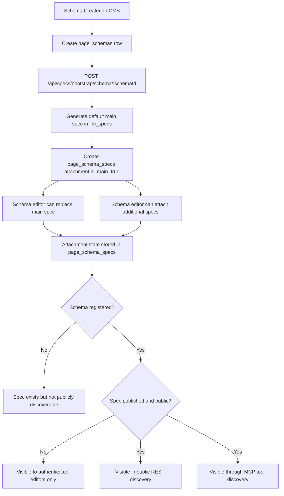
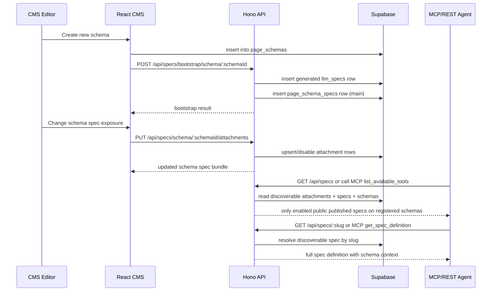

# Specs And MCP Exposition

This document describes how the Specs feature and MCP exposition work in the current implementation.

It covers:

- The database model for specs and schema attachments
- How specs are created, attached, and exposed
- The REST endpoints that exist today
- The MCP tools that exist today
- The frontend workflow in the CMS
- Current visibility rules and implementation caveats

This document reflects the codebase state as of April 11, 2026.

## 1. Purpose

The Specs feature introduces a reusable registry of agent-readable specifications that can be attached to page schemas.

The system is intentionally split into two layers:

- Page schemas still define frontend content structure, routing constraints, and frontend registration workflow.
- Specs define reusable agent-readable tool contracts that can be surfaced to agents through REST discovery and MCP.

In practical terms:

- A schema owns frontend registration.
- A schema can have one main spec and zero or more additional specs.
- Public agent discovery happens through the Specs registry, not through one route per spec.
- MCP exposes built-in registry tools and can also register discoverable specs as direct MCP tools when `metadata.mcp_exposed = true`.

## 2. High-Level Model

There are three primary concepts:

1. `page_schemas`
   These define page structure, schema registration status, and frontend integration requirements.

2. `llm_specs`
   These are reusable spec definitions for agents.

3. `page_schema_specs`
   These attach specs to schemas and determine whether a spec is enabled and whether it is the schema's main spec.

The main architectural rule is:

- A spec is globally reusable.
- A schema decides which specs are exposed in its context.

## 3. Data Model

### 3.1 `llm_specs`

The `llm_specs` table stores the reusable spec registry.

Current columns:

- `id`: UUID primary key
- `slug`: unique human-readable identifier
- `name`: display name
- `description`: optional summary
- `definition`: JSONB payload containing the actual spec contract
- `llm_instructions`: optional agent-facing guidance
- `status`: `draft | published | archived`
- `is_public`: whether the spec can appear in public discovery
- `is_main_template`: whether the spec is meant to act as a reusable template in the editor
- `tags`: JSON array for filtering/discovery
- `metadata`: JSON object for internal provenance or extra details
- `created_by`: optional author reference to `auth.users`
- `created_at`, `updated_at`

RLS behavior:

- Authenticated users can select, insert, and update specs.
- Admin and super-admin users can delete specs.
- Anonymous users can only select specs where:
  - `status = 'published'`
  - `is_public = true`

### 3.2 `page_schema_specs`

The `page_schema_specs` table attaches specs to schemas.

Current columns:

- `id`: UUID primary key
- `schema_id`: FK to `page_schemas`
- `spec_id`: FK to `llm_specs`
- `enabled`: whether the attachment is active
- `is_main`: whether this is the schema's primary spec
- `sort_order`: display/discovery ordering
- `created_at`, `updated_at`

Current constraints:

- `unique(schema_id, spec_id)` prevents duplicate attachments
- A partial unique index enforces at most one enabled main spec per schema

Anonymous read policy on attachments is stricter than the raw spec policy:

- attachment must be `enabled = true`
- attached spec must be `published` and `is_public = true`
- parent schema must be `registration_status = 'registered'`

That means public discovery is schema-aware, not just spec-aware.

## 4. Current Exposure Rules

There are two exposure models in the current implementation.

### 4.1 Unified public discovery

This is the intended public-facing discovery model.

Public discovery only shows specs that satisfy all of the following:

- the schema attachment is enabled
- the spec is published
- the spec is public
- the parent schema is registered

Direct MCP tool registration adds one more condition:

- the spec metadata must include `mcp_exposed = true`

This behavior is used by:

- `GET /api/specs` without auth
- `GET /api/specs/:slug` without auth
- MCP tool `list_available_tools`
- MCP tool `get_spec_definition`
- dynamic MCP tool registration for exposed specs

### 4.2 Schema-centric legacy/spec projection

The existing schema spec endpoints remain active:

- `GET /api/schemas/:slug/spec`
- `GET /api/schemas/:slug/spec.txt`

These endpoints now include a `SPEC REGISTRY` section built from the schema's attached specs.

Important current implementation detail:

- These endpoints call the shared bundle resolver without `publicOnly: true`.
- The resolver prefers an admin client when available.
- As a result, these schema-centric endpoints can include private or draft attached specs depending on environment and available bindings.

This is the current behavior, not the intended long-term visibility model.

If strict public-only visibility is desired for schema spec endpoints, this needs to be tightened explicitly.

## 5. Lifecycle Flow

### 5.1 Schema creation

When a new schema is created in the CMS:

1. The frontend creates the `page_schemas` row.
2. The frontend then calls `POST /api/specs/bootstrap/schema/:schemaId`.
3. The backend creates a generated main spec if one does not already exist.
4. The backend creates a `page_schema_specs` attachment with:
   - `enabled = true`
   - `is_main = true`
   - `sort_order = 0`

The generated spec is currently:

- private by default
- draft by default
- tagged with `schema`, `generated`, and the schema slug
- derived directly from the schema definition and schema instructions

### 5.2 Schema settings

After schema creation, editors can change spec exposure in the schema settings UI.

They can:

- choose a different main spec
- toggle additional attached specs
- persist attachment state through the schema attachment endpoint

The attachment update flow does not fork spec data.

This means:

- schema settings choose which specs are attached
- schema settings do not create per-schema spec copies
- the registry remains the source of truth for spec content

### 5.3 Public discovery

Once a schema is registered and the attached specs are public/published:

- REST discovery starts returning them
- MCP discovery starts returning them
- specs with `metadata.mcp_exposed = true` are also registered as direct MCP tools using their spec slug as the tool name

No server restart is required because exposure is driven by database state.

## 6. Flowchart

## 7. Sequence Diagram

## 8. Backend Modules

### 8.1 `api/lib/specRegistry.ts`

This is the central backend helper module for spec resolution.

Key responsibilities:

- generate unique spec slugs
- create default generated main specs from schema data
- attach a generated main spec to a schema
- resolve a schema's current spec bundle
- compute the public discoverable spec list
- compute a public discoverable spec by slug

Key exported functions:

#### `bootstrapSchemaMainSpec(env, schema, options)`

Creates the default generated main spec if the schema does not already have a main attachment.

Behavior:

- checks for an existing main attachment first
- reuses the existing spec if already present
- otherwise creates a new `llm_specs` row
- then creates the `page_schema_specs` main attachment

#### `getSchemaSpecBundle(env, schema, options)`

Returns:

- `main_spec`
- `attached_specs`

Used by:

- schema detail UI
- schema settings UI
- `/api/specs/schema/:schemaSlug`
- `/api/schemas/:slug/spec`
- `/api/schemas/:slug/spec.txt`

Behavior detail:

- if `publicOnly` is set, it uses the non-admin client path
- otherwise it prefers an admin client and falls back if unavailable

#### `listDiscoverableSpecs(env)`

Builds the public discovery list by joining:

- `page_schema_specs`
- `llm_specs`
- `page_schemas`

Then filters to schemas with `registration_status = 'registered'`.

The resulting object contains both:

- spec data
- schema metadata

#### `getDiscoverableSpecBySlug(env, slug)`

Convenience helper that resolves a single public spec entry by slug using the discovery list.

## 9. REST API

### 9.1 `GET /api/specs`

This route behaves differently depending on authentication.

Without `Authorization` header:

- returns only discoverable public specs attached to registered schemas
- includes `service`, `description`, `mcp_endpoint`, and `specs[]`

With `Authorization` header for a valid user role:

- returns all specs in `llm_specs`
- ordered by `updated_at desc`

### 9.2 `GET /api/specs/schema/:schemaSlug`

Returns the public bundle for one schema.

Response currently includes:

- schema summary
- `main_spec`
- `attached_specs`

This route resolves bundles with `publicOnly: true`.

### 9.3 `GET /api/specs/:slug`

Without auth:

- resolves a spec from public discoverability only

With auth:

- loads the spec directly from `llm_specs`

### 9.4 `POST /api/specs`

Creates a new spec.

Requires authenticated role `user` or above.

Required fields:

- `slug`
- `name`
- `definition`

Optional fields:

- `description`
- `llm_instructions`
- `status`
- `is_public`
- `is_main_template`
- `tags`
- `metadata`

### 9.5 `PUT /api/specs/:id`

Updates a spec.

Requires authenticated role `user` or above.

### 9.6 `DELETE /api/specs/:id`

Deletes a spec.

Requires authenticated role `admin` or above.

Current behavior is hard delete, not archive.

Because `page_schema_specs.spec_id` is `ON DELETE CASCADE`, deleting a spec also removes any schema attachments to it.

### 9.7 `PUT /api/specs/schema/:schemaId/attachments`

Updates spec exposure for a schema.

Payload:

- `main_spec_id`
- `additional_spec_ids[]`

Behavior:

- validates that the target schema exists
- validates that all requested spec IDs exist
- upserts the main attachment
- upserts additional attachments
- disables old attachments that are no longer selected
- clears `is_main` on non-selected rows when a new main spec is chosen

Important current behavior:

- old attachments are disabled, not deleted
- historical rows remain in `page_schema_specs`

### 9.8 `POST /api/specs/bootstrap/schema/:schemaId`

Creates the default generated main spec for a schema if needed.

Used immediately after schema creation by the frontend.

## 10. MCP Exposition

### 10.1 Transport and endpoint

The MCP server is exposed at:

- `GET /mcp`
- `POST /mcp`

Current transport:

- Streamable HTTP via `@hono/mcp`
- SSE-compatible connection handling

The non-SSE `GET /mcp` response acts as a human-readable/introspection-style endpoint.

It currently advertises these tools:

- `list_available_tools`
- `get_spec_definition`
- `list_schemas`
- `get_schema_spec`
- `register_frontend`
- `check_health`

### 10.2 Tool model

The current MCP implementation is tool-based.

It does not currently expose specs through MCP resource registration APIs such as `resources/list` or `resources/read`.

Instead, it exposes two spec-related tools:

#### `list_available_tools`

Purpose:

- unified public discovery of currently exposed specs

Behavior:

- calls `listDiscoverableSpecs(env)`
- returns a JSON string inside an MCP text content block

Current response payload shape inside `content[0].text`:

- `specs[]`
- `total`

Each returned spec includes:

- `slug`
- `name`
- `description`
- `schema`
- `is_main`
- `detail_url`

#### `get_spec_definition`

Purpose:

- retrieve the full discoverable spec definition by slug

Behavior:

- calls `getDiscoverableSpecBySlug(env, slug)`
- returns a JSON string inside an MCP text content block

Current MCP design detail:

- payloads are JSON stringified into a text content block
- the tool does not return structured JSON values outside the MCP content array

### 10.3 Legacy schema MCP tools remain active

The schema-centric MCP tools are still active:

- `list_schemas`
- `get_schema_spec`
- `register_frontend`
- `check_health`

So the MCP server currently exposes both:

- the new spec-centric discovery model
- the older schema-centric integration model

This is intentional for compatibility.

## 11. Frontend Workflow

### 11.1 Specs repository UI

The CMS currently includes:

- `/specs`
- `/specs/new`
- `/specs/:specSlug`

Capabilities in the repository UI:

- list all specs
- search and filter by status and visibility
- create a new spec
- edit an existing spec
- archive/restore a spec by status update
- delete a spec permanently
- open the REST API detail route

### 11.2 Spec editor

The spec editor currently supports:

- basic metadata editing
- raw JSON definition editing
- status changes
- public/private toggle
- template flag toggle
- tag entry
- LLM instruction entry
- starter templates
- structural validation warnings

Current definition validation rules:

- root must be a JSON object
- `kind` is required and must be a string
- `version` is required and must be a string
- `input_schema` must be an object when present
- `output_schema` must be an object when present

Current non-blocking authoring warnings:

- missing `input_schema`
- missing both `output_schema` and `output_expectations`
- missing `schema` object for `schema-main-spec`

### 11.3 Schema settings UI

Schema settings now include a `Spec Registry & Tool Exposure` section.

Editors can:

- view the current main spec
- switch the main spec
- attach additional specs
- save the resulting attachment model

For new schemas:

- the UI explains that the main spec is generated after first save

### 11.4 Schema detail UI

Schema detail now includes a read-only Specs panel.

It shows:

- the current main spec
- any additional attached specs
- a shortcut back to schema settings

### 11.5 Registration waiting screen

The waiting screen now points builders to:

- the unified specs discovery endpoint
- the schema-specific tool bundle endpoint
- the existing schema spec endpoints

So frontend builders and agents now see both:

- the schema contract
- the tool/spec contract bundle

## 12. Current Discovery Surface Summary

For agents, the current discovery entrypoints are:

### Public REST

- `GET /api/specs`
  Primary public discovery for specs

- `GET /api/specs/:slug`
  Public detail for a discoverable spec

- `GET /api/specs/schema/:schemaSlug`
  Public schema-specific bundle for registered/public exposure

### MCP

- `GET /mcp`
  Tool list/introspection for browsers and non-SSE clients

- MCP tool `list_available_tools`
  Primary agent discovery route inside MCP

- MCP tool `get_spec_definition`
  Detail fetch for a discoverable spec inside MCP

### Schema-centric compatibility endpoints

- `GET /api/schemas/:slug/spec`
- `GET /api/schemas/:slug/spec.txt`

These still exist and now embed spec registry information.

## 13. Known Limitations And Current Caveats

### 13.1 Schema-centric spec endpoints can expose more than public discovery

This is the most important current caveat.

The unified public spec routes are filtered correctly for public discovery.

However, the schema-centric endpoints call the shared bundle resolver without `publicOnly: true`, which means they may include private or draft attached specs depending on runtime environment.

This should be treated as a current implementation detail that may need tightening.

### 13.2 MCP is tool-based, not resource-based

The MCP server does not currently expose specs through MCP resource APIs.

Instead:

- discovery is done through tools
- spec reads are done through tools

That is valid, but it is narrower than a full MCP resource implementation.

### 13.3 Discovery payloads are JSON strings inside text blocks

The MCP tools currently return JSON string payloads inside `content: [{ type: 'text', text: ... }]`.

This is easy to consume, but it is not strongly typed beyond the JSON string itself.

### 13.4 Attachment updates disable rows rather than removing them

The current attachment write path preserves old rows by setting:

- `enabled = false`
- `is_main = false`

This is useful for history and auditing, but the table can accumulate stale attachment rows over time.

### 13.5 Generated main specs are created client-orchestrated

The current new-schema flow is:

- create schema from the client
- then call bootstrap API

This means spec bootstrapping is not yet part of a single server-side transaction.

The frontend currently soft-fails bootstrap errors so schema creation does not appear to fail after the schema row already exists.

## 14. Current End-to-End Behavior

In plain terms, the system works like this today:

1. Editors create or edit reusable specs in the Specs repository.
2. A new schema automatically gets a generated draft main spec.
3. Editors decide which registry specs are attached to the schema.
4. Once the schema is registered and the attached specs are public/published, those specs appear in public discovery.
5. Agents can discover them through REST or the MCP `list_available_tools` tool.
6. Agents can then fetch the full spec through REST or the MCP `get_spec_definition` tool.
7. The older schema-specific spec endpoints still exist and still describe schema registration and content structure.

## 15. Recommended Follow-Up Work

The current implementation is functional, but these areas are the most obvious next steps:

1. Tighten schema-centric endpoint visibility so `/api/schemas/:slug/spec` and `/api/schemas/:slug/spec.txt` honor public exposure rules explicitly.
2. Add first-class MCP resource support if agents should treat specs as resources rather than tool-returned JSON.
3. Move schema creation plus main-spec bootstrap into one server-side transaction.
4. Add explicit audit/history or cleanup strategy for disabled attachment rows.
5. Add stronger spec-definition validation if the team wants a stricter canonical spec contract.

## 16. Relevant Files

The current implementation is primarily defined in these files:

- `migrations/llm_specs.sql`
- `migrations/page_schema_specs.sql`
- `api/lib/specRegistry.ts`
- `api/routes/specs.ts`
- `api/routes/mcp.ts`
- `api/routes/schemas.ts`
- `src/services/specService.ts`
- `src/pages/Specs.tsx`
- `src/pages/SpecEditor.tsx`
- `src/pages/SchemaEditor.tsx`
- `src/pages/PagesSchemaDetail.tsx`
- `src/components/pagebuilder/SchemaWaitingScreen.tsx`
